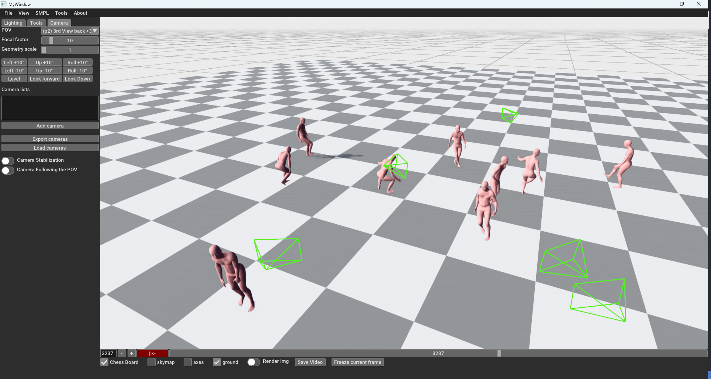
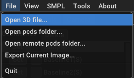
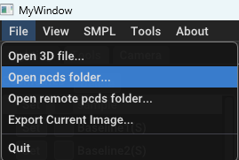
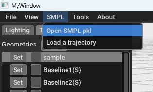
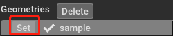
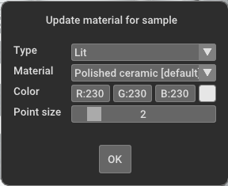
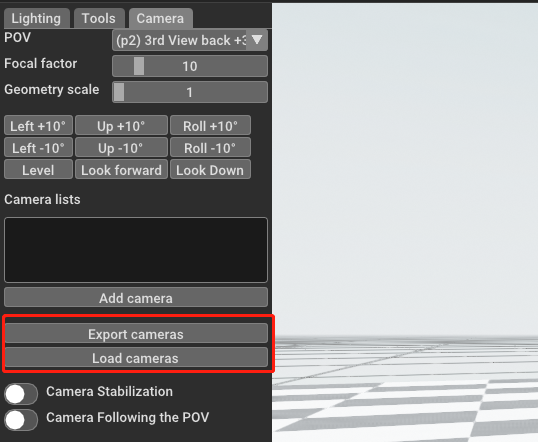
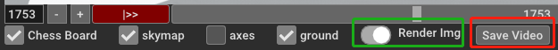

Global SMPL and Scene Visualization Tool (GSVT)
===========================

[](https://github.com/isl-org/Open3D/actions?query=workflow%3A%22Ubuntu+CI%22)
[](https://github.com/isl-org/Open3D/actions?query=workflow%3A%22macOS+CI%22)
[](https://github.com/isl-org/Open3D/actions?query=workflow%3A%22Windows+CI%22)

This is a simple and fast GUI tool to quantitatively visualize and compare the SMPL results in real-time. It is developed based on [Open3D](http://www.open3d.org/) and can be run on a CPU-only computer. If you want better rendering results, you should turn to Blender, Unity, etc. 



### Requirements
1. Download the SMPL model `basicModel_neutral_lbs_10_207_0_v1.0.0.pkl`, `basicModel_f_lbs_10_207_0_v1.0.0.pkl`, `basicModel_m_lbs_10_207_0_v1.0.0.pkl` and `J_regressor_extra.npy` from http://smpl.is.tue.mpg.de and put them in `smpl` directory.
2. (Optional) `ffmpeg` for video processing

### Installation  
```
conda create --name GSVT python==3.9 -y
conda activate GSVT
pip install numpy open3d matplotlib scipy opencv-python torch torchvision torchaudio paramiko chumpy lzf 
```
  
### Run
```
python main_gui.py
```
A demo file is in [imgs/smpl_sample.pkl](imgs/smpl_sample.pkl)

### Some usage examples
| # | Function | Button |
|---|---|----
| 1 |`.pcd` `.ply` `.obj` `.xyz` `.xyzn` visualization | 
| 2 |`.pcd` sequence visualization | 
| 3 | SMPL sequence (`.pkl`) visualization <br> The data structure is detailed at [readme](gui_vis/readme.md) | 
| 4 | Geometry's material editing |  
| 5 | Camera load/save |  
| 5 | Rendering and generating the video (with camera automatically saved). <br> - **Start**: Toggle on the `Render img` <br> - **End**: Click the `Save video` <br> - The video will automatically be saved when the play bar meets the end.  |  
   

## Todos

- [x] Save the video with GUI
- [x] Add shade, HDR map ...
- [x] Load video
- [x] Generate / save camera trajectetory
- [ ] Save the video with headless mode

### License
The codebase is licensed under the Creative Commons Attribution-NonCommercial-ShareAlike 3.0 License. You must attribute the work in the manner specified by the authors, you may not use this work for commercial purposes and if you alter, transform, or build upon this work, you may distribute the resulting work only under the same license. 