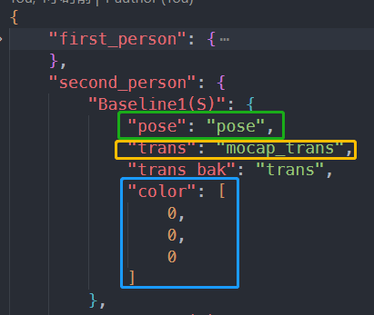

### Structure of smpl_key.json

- If the structure of a SMPL file (.pkl) is as follows:
  ```bash
  # At least contains the 'pose' and 'mocap_trans'  
  smpl_sample.pkl/
  ├──'first_person'
  |  ├── 'pose' # (N, 72) or (N, 24, 3, 3)
  |  ├── 'mocap_trans' # (N, 3)
  |  ├── 'lidar_traj'  # (N, a), a ≥ 4 and coordinate xyz in [:, 1:4]
  |  ├── 'opt_pose'  # (N, 72) or (N, 24, 3, 3)
  |  └── 'opt_trans'  # (N, 3)
  ├──'second_person'
  |  ├── 'pose'  # (N, 72) or (N, 24, 3, 3)
  |  ├── 'mocap_trans'  # (N, 3)
  |  ├── 'opt_pose'  # (N, 72) or (N, 24, 3, 3)
  |  ├── 'opt_trans'  # (N, 3)
  |  ├── 'point_frame'  # (n, ) n ≤ N, 'point_frame' ∈ 'frame_num'
  |  └── 'point_clouds'  # (n, 3) n ≤ N
  └──'frame_num' # (N, )
  ```
  and I want to visualize the SMPL pose from `pose` field and `trans` field of the `second_person`, and name this SMPL model as `Basedline1(S)`, I can add content in `smpl_key.json` as follows:

    - 