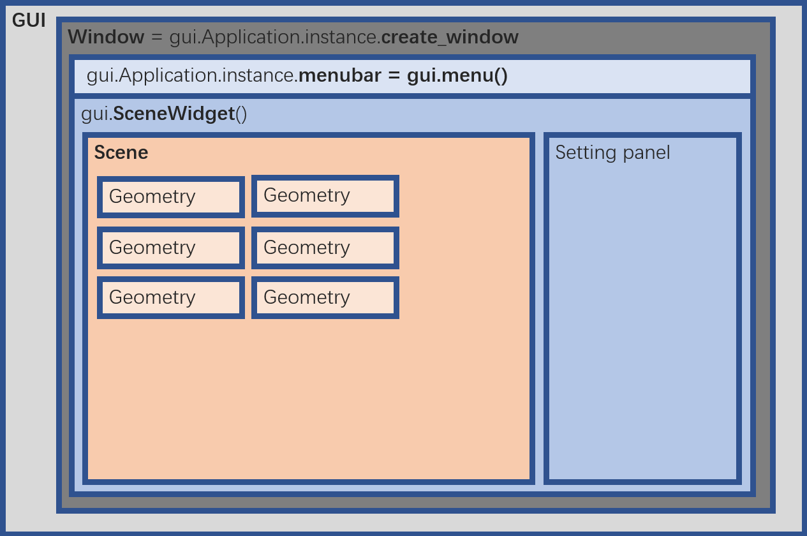

## GUI

### 1. [base_gui](base_gui.py)

- GUI的基类，所有的类都需要继承该类，其逻辑如下图所示



```python
# 可以定义多个3D widget, 创建不同的场景, geometry添加到SceneWidget的scene
self.window = gui.Application.instance.create_window("Open3D", width, height)
self._scene = gui.SceneWidget()
self._scene.scene = rendering.Open3DScene(w.renderer)

w.set_on_layout(self._on_layout) #绘制布局
```
- 蓝色的是layout, 黄色的是场景和需要可视化的对象
- layout可以通过绘制frame,定义其左上角坐标和长宽

### 2. [gui_material](gui_material.py)

- 用于定义物体材料性质, 包括阴影, 颜色, 点的大小
- 包含scene的一些属性, 包括光照类型、颜色、方向, 控制显示地面网格, 坐标轴, 环境光

### 3. [settings](settings.py)
- 自定义布局中的设置
- 定义了thread函数, 用于读取一个序列(点云、SMPL等), 仅需根据需求实现下列函数
  - fetch_data
  - update_data


### 4. [menu](menu.py)
- 自定义布局中的菜单栏
